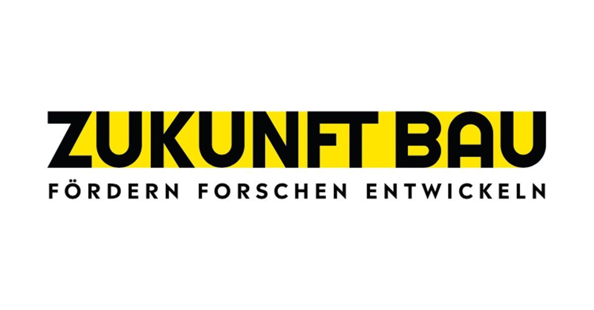

# CalibLab

### README Section: Aim of the Repository

This repository provides a comprehensive framework for building energy model calibration with applied uncertainty analysis. The framework leverages Bayesian methods, grounded in Bayes' theorem, to iteratively update prior beliefs about parameter values using observed data. By incorporating this probabilistic approach, users can effectively quantify and manage uncertainty in energy modeling.

The framework is seamlessly integrated with the **DIBS simulation tool**, ensuring a streamlined implementation. Additionally, it is designed with modularity in mind, allowing users to exchange or modify individual steps to suit specific requirements or preferences.

Our aim is to make Bayesian calibration accessible and straightforward for  energy modelers and researchers. While the primary focus is on building energy models, the framework is versatile and can be extended to other systems requiring robust uncertainty management. 

As an open-source initiative, we welcome contributions, feedback, and innovative applications of this repository. We look forward to seeing how it evolves and supports advancements in energy modeling and beyond.

# Getting Started

You can install CalibLab via downloading the zip file or either clone this repository.

The user must provide the following files in the "data" folder:
- **Metered data** ("HeatEnergyDemand_30034001_Y.xlsx")
- **Degree of uncertainty of model parameters** ("prior_probability_definition.xlsx")
- **Fixed model parameters for DIBS** ("fixed_variables.xlsx")
- **Prior model parameter values** ("variables_df.xlsx")

 The framework is run from the main file "src/main.py"

Required inputs:
- **Building ID**
- **Time resolution**: Yearly ('Y'), Monthly ('M'), Weekly ('W') etc.
- **Climate data type**: Actual Meteorological Year ('AMY') or Test Reference Year, Potsdam ('TRY')
- **Climate file**: File name
- **Number of calibration parameters**

Optional inputs:
- Request for automatized convergence search for Sensitivity Analysis
- Request for automatized convergence search for Gaussian Processes
- Percentage of metered data used for the calibration

# Main  Python packages:
Basic packages:
- [Pandas](https://pypi.org/project/pandas/)
- [Numpy](https://pypi.org/project/numpy/)

DIBS:
- [Namedlist](https://pypi.org/project/namedlist/)
- [Geopy](https://pypi.org/project/geopy/)

Sensitivity Analysis:
- [SALib](https://salib.readthedocs.io/en/latest/)

Gaussian Processes:
- [Scikit-learn](https://scikit-learn.org/stable/)

Bayesian Inference:
- [PyMC3](https://pypi.org/project/pymc3/)
- [Arviz](https://python.arviz.org/en/stable/)
- [Theano](https://pypi.org/project/Theano/)

# Usage
The repository includes two example building models along with their results, providing users with a practical starting point for utilizing the framework. Additionally, a Jupyter Notebook script is included to guide users through the framework step-by-step. The notebook visualizes each stage of the process and offers detailed explanations to enhance understanding and ease of application.

# Publications

Fülep, Katalin; Kalathiparambil Kennedy, Mary Lidiya; Brandt, Stefan; Streblow, Rita (2024): An Open-Source Framework: Bayesian Building Energy Model Calibration with Uncertainty Quantification. In the proceedings of the uSIM2024 in Edinburgh, 25. November 2024.

Fülep, Katalin; Chen, Siling; Brandt, Stefan; Streblow, Rita (2024): Advancing Building Energy Modeling: An Open-Source Bayesian Calibration Framework for Non-Residential Buildings. In the proceedings of the SimBuild in Denver, Colorado, 21-23 May 2024. In SimBuild 2024 URL: https://publications.ibpsa.org/conference/paper/?id=simbuild2024_2292

---
The CalibLab has been developed in context of the [BaU-SaN project](https://www.zukunftbau.de/projekte/forschungsfoerderung/1008187-2137zukunftbau
) funded by Forschungsinitiative Zukunft Bau des Bundesinstitutes für Bau-, Stadt- und Raumforschung (reference number SWD-10.08.18.7-21.37). ZUKUNFT BAU [www.zukunftbau.de](https://www.zukunftbau.de/)

